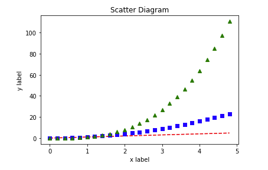

内容介绍
《Python数据可视化》介绍了利用Python实现数据可视化。并介绍了数据、信息与知识之间的关系。书中涉及的可视化过程应用了大量流行的Python库，你会学到采用Numpy、Scipy、IPython、MatPotLib、Pandas、Patsy和Scikit-Learn等生成可视化结果的不同方法。

内容节选
分享Python绘制六种可视化图表

可视化图表，有相当多种，但常见的也就下面几种，其他比较复杂一点，大都也是基于如下几种进行组合，变换出来的。对于初学者来说，很容易被这官网上众多的图表类型给吓着了，由于种类太多，几种图表的绘制方法很有可能会混淆起来。

因此，在这里，我特地总结了六种常见的基本图表类型，你可以通过对比学习，打下坚实的基础。

## 01. 折线图

绘制折线图，如果你数据不是很多的话，画出来的图将是曲折状态，但一旦你的数据集大起来，比如下面我们的示例，有100个点，所以我们用肉眼看到的将是一条平滑的曲线。

这里我绘制三条线，只要执行三次 plt.plot 就可以了。
```python
import numpy as np
import matplotlib.pyplot as plt
x= np.linspace(0, 2, 100)
plt.plot(x, x, label='linear')
plt.plot(x, x**2, label='quadratic')
plt.plot(x, x**3, label='cubic')
plt.xlabel('x label')
plt.ylabel('y label')
plt.title("Simple Plot")
plt.legend()
plt.show()
```


---
## 02. 散点图

其实散点图和折线图是一样的原理，将散点图里的点用线连接起来就是折线图了。所以绘制散点图，只要设置一下线型即可。

注意：这里我也绘制三条线，和上面不同的是，我只用一个 plt.plot 就可以了。
```python
import numpy as np
import matplotlib.pyplot as plt
x = np.arange(0., 5., 0.2)
# 红色破折号, 蓝色方块 ，绿色三角块
plt.plot(x, x, 'r--', x, x**2, 'bs', x, x**3, 'g^')
plt.show()
```

---
## 03. 直方图

直方图，大家也不算陌生了。这里小明加大难度，在一张图里，画出两个频度直方图。这应该在实际场景上也会遇到吧，因为这样真的很方便比较，有木有？
```python
import numpy as np
import matplotlib.pyplot as plt
np.random.seed(19680801)
mu1, sigma1 = 100, 15
mu2, sigma2 = 80, 15
x1 = mu1 + sigma1 * np.random.randn(10000)
x2 = mu2 + sigma2 * np.random.randn(10000)
# the histogram of the data
# 50：将数据分成50组
# facecolor：颜色；alpha：透明度
# density：是密度而不是具体数值
n1, bins1, patches1 = plt.hist(x1, 50, density=True, facecolor='g', alpha=1)
n2, bins2, patches2 = plt.hist(x2, 50, density=True, facecolor='r', alpha=0.2)
# n：概率值；bins：具体数值；patches：直方图对象。
plt.xlabel('Smarts')
plt.ylabel('Probability')
plt.title('Histogram of IQ')
plt.text(110, .025, r'$\mu=100,\ \sigma=15$')
plt.text(50, .025, r'$\mu=80,\ \sigma=15$')
# 设置x，y轴的具体范围
plt.axis([40, 160, 0, 0.03])
plt.grid(True)
plt.show()
```

---
## 04. 柱状图

同样的，简单的柱状图，我就不画了，这里画三种比较难的图。

4.1 并列柱状图
```python
import numpy as np
import matplotlib.pyplot as plt
size = 5
a = np.random.random(size)
b = np.random.random(size)
c = np.random.random(size)
x = np.arange(size)
# 有多少个类型，只需更改n即可
total_width, n = 0.8, 3  
width = total_width / n
# 重新拟定x的坐标
x = x - (total_width - width) / 2
# 这里使用的是偏移
plt.bar(x, a, width=width, label='a')
plt.bar(x + width, b, width=width, label='b')
plt.bar(x + 2 * width, c, width=width, label='c')
plt.legend()
plt.show()
```

---
4.2 叠加柱状图
```python
import numpy as np
import matplotlib.pyplot as plt
size = 5
a = np.random.random(size)
b = np.random.random(size)
c = np.random.random(size)
x = np.arange(size)
# 这里使用的是偏移
plt.bar(x, a, width=0.5, label='a',fc='r')
plt.bar(x, b, bottom=a, width=0.5, label='b', fc='g')
plt.bar(x, c, bottom=a+b, width=0.5, label='c', fc='b')
plt.ylim(0, 2.5)
plt.legend()
plt.grid(True)
plt.show()
```

---
## 05. 饼图

5.1 普通饼图
```python
import matplotlib.pyplot as plt
labels = 'Frogs', 'Hogs', 'Dogs', 'Logs'
sizes = [15, 30, 45, 10]
# 设置分离的距离，0表示不分离
explode = (0, 0.1, 0, 0) 
plt.pie(sizes, explode=explode, labels=labels, autopct='%1.1f%%',
  shadow=True, startangle=90)
# Equal aspect ratio 保证画出的图是正圆形
plt.axis('equal') 
plt.show()
```

---
5.2 嵌套饼图
```python
import numpy as np
import matplotlib.pyplot as plt
# 设置每环的宽度
size = 0.3
vals = np.array([[60., 32.], [37., 40.], [29., 10.]])
# 通过get_cmap随机获取颜色
cmap = plt.get_cmap("tab20c")
outer_colors = cmap(np.arange(3)*4)
inner_colors = cmap(np.array([1, 2, 5, 6, 9, 10]))
print(vals.sum(axis=1))
# [92. 77. 39.]
plt.pie(vals.sum(axis=1), radius=1, colors=outer_colors,
  wedgeprops=dict(width=size, edgecolor='w'))
print(vals.flatten())
# [60. 32. 37. 40. 29. 10.]
plt.pie(vals.flatten(), radius=1-size, colors=inner_colors,
  wedgeprops=dict(width=size, edgecolor='w'))
# equal 使得为正圆
plt.axis('equal') 
plt.show()
```

---
5.3 极轴饼图

要说酷炫，极轴饼图也是数一数二的了，这里肯定也要学一下。
```python
import numpy as np
import matplotlib.pyplot as plt
np.random.seed(19680801)
N = 10
theta = np.linspace(0.0, 2 * np.pi, N, endpoint=False)
radii = 10 * np.random.rand(N)
width = np.pi / 4 * np.random.rand(N)
ax = plt.subplot(111, projection='polar')
bars = ax.bar(theta, radii, width=width, bottom=0.0)
# left表示从哪开始，
# radii表示从中心点向边缘绘制的长度（半径）
# width表示末端的弧长
# 自定义颜色和不透明度
for r, bar in zip(radii, bars):
 bar.set_facecolor(plt.cm.viridis(r / 10.))
 bar.set_alpha(0.5)
plt.show()
```

---
## 06. 三维图

6.1 绘制三维散点图
```python
import numpy as np
import matplotlib.pyplot as plt
from mpl_toolkits.mplot3d import Axes3D
data = np.random.randint(0, 255, size=[40, 40, 40])
x, y, z = data[0], data[1], data[2]
ax = plt.subplot(111, projection='3d') # 创建一个三维的绘图工程
# 将数据点分成三部分画，在颜色上有区分度
ax.scatter(x[:10], y[:10], z[:10], c='y') # 绘制数据点
ax.scatter(x[10:20], y[10:20], z[10:20], c='r')
ax.scatter(x[30:40], y[30:40], z[30:40], c='g')
ax.set_zlabel('Z') # 坐标轴
ax.set_ylabel('Y')
ax.set_xlabel('X')
plt.show()
```

---
6.2 绘制三维平面图
```python
from matplotlib import pyplot as plt
import numpy as np
from mpl_toolkits.mplot3d import Axes3D
fig = plt.figure()
ax = Axes3D(fig)
X = np.arange(-4, 4, 0.25)
Y = np.arange(-4, 4, 0.25)
X, Y = np.meshgrid(X, Y)
R = np.sqrt(X**2 + Y**2)
Z = np.sin(R)
# 具体函数方法可用 help(function) 查看，如：help(ax.plot_surface)
ax.plot_surface(X, Y, Z, rstride=1, cstride=1, cmap='rainbow')
plt.show()
```

---


# 目录
译者序
前　言
### 第1章　数据可视化概念框架1
1.1　数据、信息、知识和观点2
1.1.1　数据2
1.1.2　信息2
1.1.3　知识3
1.1.4　数据分析和观点3
1.2　数据转换4
1.2.1　数据转换为信息4
1.2.2　信息转换为知识7
1.2.3　知识转换为观点7
1.3　数据可视化历史8
1.4　可视化如何帮助决策10
1.4.1　可视化适用于哪里11
1.4.2　如今的数据可视化12
1.5　可视化图像15
1.5.1　条形图和饼图19
1.5.2　箱线图22
1.5.3　散点图和气泡图23
1.5.4　核密度估计图26
1.6　总结29
### 第2章　数据分析与可视化30
2.1　为什么可视化需要规划31
2.2　Ebola案例31
2.3　体育案例37
2.4　用数据编写有趣的故事47
2.4.1　为什么故事如此重要47
2.4.2　以读者驱动为导向的故事47
2.4.3　以作者驱动为导向的故事53
2.5　感知与表达方法55
2.6　一些好的可视化实践57
2.6.1　比较和排名57
2.6.2　相关性58
2.6.3　分布59
2.6.4　位置定位或地理数据61
2.6.5　局部到整体的关系61
2.6.6　随时间的变化趋势62
2.7　Python中的可视化工具62
2.8　交互式可视化64
2.8.1　事件监听器64
2.8.2　布局设计65
2.9　总结67
### 第3章　开始使用Python IDE69
3.1　Python中的IDE工具70
3.1.1　Python 3.x和Python 2.770
3.1.2　交互式工具类型70
3.1.3　Python IDE类型72
3.2　Anaconda可视化绘图83
3.2.1　表面三维图83
3.2.2　方形图85
3.3　交互式可视化软件包89
3.3.1　Bokeh 89
3.3.2　VisPy90
3.4　总结91
### 第4章　数值计算和交互式绘图92
4.1　NumPy、SciPy和MKL函数93
4.1.1　NumPy93
4.1.2　SciPy99
4.1.3　MKL函数105
4.1.4　Python的性能106
4.2　标量选择106
4.3　切片107
4.4　数组索引108
4.4.1　数值索引108
4.4.2　逻辑索引109
4.5　其他数据结构110
4.5.1　栈110
4.5.2　元组111
4.5.3　集合112
4.5.4　队列113
4.5.5　字典114
4.5.6　字典的矩阵表示115
4.5.7　Trie树120
4.6　利用matplotlib进行可视化121
4.6.1　词云122
4.6.2　安装词云122
4.6.3　词云的输入 124
4.6.4　绘制股票价格图129
4.7　体育运动中的可视化案例136
4.8　总结140
### 第5章　金融和统计模型141
5.1　确定性模型142
5.2　随机性模型150
5.2.1　蒙特卡洛模拟150
5.2.2　投资组合估值168
5.2.3　模拟模型 170
5.2.4　几何布朗运动模拟170
5.2.5　基于扩散模拟173
5.3　阈值模型175
5.4　统计与机器学习综述179
5.4.1　k-近邻算法179
5.4.2　广义线性模型181
5.5　创建动画和交互图184
5.6　总结188
### 第6章　统计与机器学习189
6.1　分类方法190
6.1.1　理解线性回归191
6.1.2　线性回归193
6.1.3　决策树196
6.1.4　贝叶斯理论199
6.1.5　朴素贝叶斯分类器200
6.1.6　用TextBlob构建朴素贝叶斯分类器202
6.1.7　用词云观察积极情绪206
6.2　k-近邻208
6.3　逻辑斯谛回归211
6.4　支持向量机214
6.5　主成分分析216
6.6　 k-均值聚类220
6.7　总结223
### 第7章　生物信息学、遗传学和网络模型224
7.1　有向图和多重图225
7.1.1　存储图表数据225
7.1.2　图表展示227
7.2　图的聚集系数235
7.3　社交网络分析238
7.4　平面图测试 240
7.5　有向无环图测试 242
7.6　大流量和小切割244
7.7　遗传编程示例245
7.8　随机区组模型247
7.9　总结250
### 第8章　高级可视化252
8.1　计算机模拟253
8.1.1　Python的random包253
8.1.2　SciPy的random函数254
8.1.3　模拟示例255
8.1.4　信号处理258
8.1.5　动画制作261
8.1.6　利用HTML5进行可视化263
8.1.7　Julia和Python有什么区别267
8.1.8　用D3.js进行可视化267
8.1.9　仪表盘268
8.2　总结269
附录　继续探索可视化270